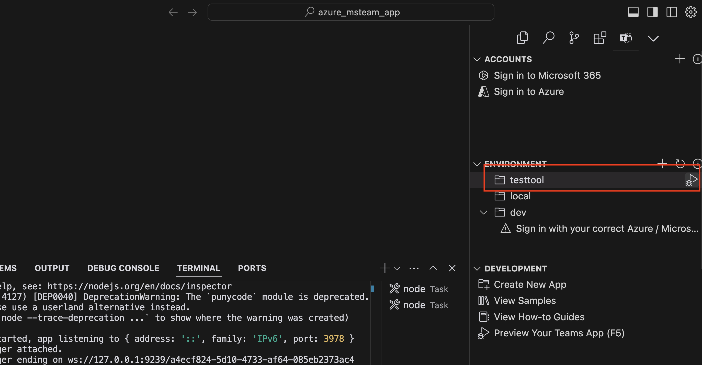

# BeeBot Agentic AI Chatbot Framework

A comprehensive AI chatbot framework that integrates Microsoft Teams with AWS Bedrock agents, powered by AWS Lambda functions for scalable, serverless AI operations.

## 🏆 AWS Lambda Hackathon Submission

This project is submitted for the [AWS Lambda Hackathon](https://awslambdahackathon.devpost.com/?) - "Build solutions that scale: power your ideas with AWS Lambda"

## 🚀 How This Application Uses AWS Lambda

### Core Lambda Architecture

Our application leverages AWS Lambda as the backbone for all AI agent operations, implementing a **serverless microservices architecture** that scales automatically based on demand. Here's how we use AWS Lambda:

#### 1. **Lambda Functions as Action Group Executors**
Each AI agent in our system uses dedicated Lambda functions to handle specific tasks. **These are example implementations demonstrating the framework's capabilities:**

- **HelloWorld Agent Lambda** (`lambda/helloWorld_agent/`): Example agent handling basic greeting and demonstration operations
- **HackerNews Agent Lambda** (`lambda/hacker_news_agent/`): Example agent fetching and processing Hacker News data via external APIs
- **Time Agent Lambda** (`lambda/time/`): Example agent providing current time and date information
- **Knowledge Base Sync Lambda** (`lambda/sync_bedrock_knowledgebase/`): Example implementation for document ingestion and knowledge base updates

**Framework Feature**: All Lambda functions use **OpenAPI specifications** to define their API schemas, enabling seamless integration with AWS Bedrock agents through standardized API contracts.

#### 2. **Lambda Triggers and Integration**
Our Lambda functions are triggered through multiple mechanisms:

- **AWS Bedrock Agent Invocation**: Primary trigger - Bedrock agents directly invoke Lambda functions for action execution
- **S3 Event Triggers**: - Knowledge base sync operations are automatically triggered when documents are uploaded to S3

#### 3. **S3 Event Trigger Implementation** 🆕
We've implemented **S3 Event Triggers** to demonstrate event-driven architecture:

```python
# Lambda function triggered by S3 OBJECT_CREATED events
def lambda_handler(event: Dict[str, Any], context: Any) -> Dict[str, Any]:
    # Extract S3 event information
    s3_event = event.get('Records', [{}])[0].get('s3', {})
    bucket_name = s3_event.get('bucket', {}).get('name')
    object_key = s3_event.get('object', {}).get('key')
    
    # Automatically start ingestion job for new documents
    response = bedrock_agent_client.start_ingestion_job(
        dataSourceId=data_source_id,
        knowledgeBaseId=knowledge_base_id
    )
```

**Trigger Configuration:**
- **Event Type**: `OBJECT_CREATED`
- **Supported File Types**: `.pdf`, `.txt`, `.docx`, `.md`
- **Automatic Processing**: New documents are automatically synced to Bedrock Knowledge Base
- **Error Handling**: Comprehensive logging and error management

#### 4. **Serverless Best Practices Implementation**
We follow AWS Lambda best practices:

```typescript
// Example from helloWorld_agent Lambda
export const handler = middy(adapter)
  .use(captureLambdaHandler(tracer))    // Distributed tracing
  .use(logMetrics(metrics));            // CloudWatch metrics
```

- **Observability**: Integrated with AWS Lambda Powertools for tracing, metrics, and logging
- **Error Handling**: Comprehensive error handling with proper HTTP status codes
- **Timeout Management**: 60-second timeouts for optimal performance
- **Cold Start Optimization**: Node.js 20.x runtime for better performance

#### 5. **Lambda Function Examples with OpenAPI Integration**

**Framework Feature**: Each Lambda function includes an **OpenAPI specification** that defines the API schema for Bedrock agent integration:

```json
// Example OpenAPI spec from helloWorld_agent/schema/api-schema.json
{
  "openapi": "3.0.0",
  "info": {
    "title": "HelloWorld Agent API",
    "version": "1.0.0"
  },
  "paths": {
    "/getHelloWorld": {
      "get": {
        "summary": "Get hello world message",
        "responses": {
          "200": {
            "description": "Successful response"
          }
        }
      }
    }
  }
}
```

**HackerNews Agent Lambda** - Example demonstrating external API integration:
```typescript
case '/getTopStories':
  if (httpMethod === 'GET') {
    const response = await axios.get<number[]>(TOP_STORIES_URL);
    const stories = response.data.slice(0, limit);
    body = { stories };
  }
  break;
```

**Time Agent Lambda** - Example showing simple data processing:
```typescript
case '/getCurrentTime':
  if (httpMethod === 'GET') {
    body = {
      currentTime: new Date().toISOString()
    };
  }
  break;
```

**Knowledge Base Sync Lambda** - Example demonstrating S3 event processing:
```python
# Triggered automatically when documents are uploaded to S3
if file_extension not in [ext.replace('.', '') for ext in supported_extensions]:
    logger.info(f"Skipping file {object_key} - unsupported file type: {file_extension}")
    return {'statusCode': 200, 'body': json.dumps({'message': f'Skipped unsupported file type: {file_extension}'})}
```

#### 6. **Scalability and Performance**
- **Auto-scaling**: Lambda functions automatically scale from 0 to thousands of concurrent executions
- **Cost optimization**: Pay only for actual compute time used
- **High availability**: Multi-AZ deployment with automatic failover
- **Performance monitoring**: Real-time metrics and tracing

#### 7. **Integration with AWS Services**
Our Lambda functions integrate with:
- **AWS Bedrock**: For AI model inference and agent orchestration
- **Amazon S3**: For document storage and knowledge base management
- **CloudWatch**: For monitoring, logging, and alerting
- **IAM**: For secure access control and permissions

### Architecture Diagram


## 🛠️ Framework Features

### **Extensible Agent System**
The framework provides a **modular architecture** where you can easily create new AI agents by:
1. **Defining OpenAPI specifications** for your Lambda functions
2. **Implementing Lambda handlers** following the framework patterns
3. **Configuring agent instructions** and capabilities
4. **Deploying with CDK** for infrastructure as code

### **OpenAPI Integration**
- **Standardized API Contracts**: All Lambda functions use OpenAPI 3.0 specifications
- **Automatic Agent Integration**: Bedrock agents automatically understand function capabilities
- **Type Safety**: Strong typing and validation through OpenAPI schemas
- **Documentation**: Self-documenting APIs through OpenAPI specs

### **Event-Driven Architecture**
- **S3 Triggers**: Automatic document processing workflows
- **Scalable Processing**: Handle multiple concurrent uploads
- **Error Handling**: Comprehensive retry and dead letter queues
- **Monitoring**: Real-time metrics and observability

## Azure MS Teams App
Ensure you have node installed
```
nvm install v18.20.2
nvm use v18.20.2
```

Install dependencies
```
cd azure_msteams_app
npm install
```

## AWS Bedrock
```
nvm install v20.11.0
nvm use v20.11.0
```

Install dependencies
```
cd aws_bedrock
npm install
```

## Replace the AWS Bedrock AI Agent and AI Agent Alias Name
In the file `aws_bedrock/lib/aws_bedrock-stack.ts`, replace the AI Agent and AI Agent Alias Name with your own.
Search for `your-unique-agent-alias` and replace it with your own.

Ensure AWS CLI is configured with your credentials:
```
aws configure
```

Setup AWS Bedrock
```
cdk bootstrap
npx cdk deploy --all
```


## Run the MS Teams App locally
The output from AWS CDK will provide you with the Knowledge Base ID, Agent ID and Agent Alias ID.

Create the file `.localConfigs.testTool` from the `.localConfigs.testTool.example` file.
Update the `.localConfigs.testTool` file with the correct values.
```
AWS_AGENT_ALIAS_ID=
AWS_AGENT_ID=
AWS_KNOWLEDGE_BASE_ID=
```

## Install the Teams Toolkit Extension for Visual Studio Code


## Run the MS Teams App locally
```
cd azure_msteams_app
npm install
```

## Start Microsoft 365 Agent Toolkit

Click on the play icon




## Example of the MS Teams App Chat


## 🛠️ AWS Tools Used

- **AWS Lambda**: Core serverless compute service for all agent operations
- **AWS Bedrock**: AI model inference and agent orchestration
- **Amazon S3**: Document storage, knowledge base management, and event triggers
- **AWS CloudWatch**: Monitoring, logging, and observability
- **AWS IAM**: Security and access control
- **AWS CDK**: Infrastructure as Code deployment
- **AWS Lambda Powertools**: Observability and best practices

## 📊 Lambda Function Metrics

Our Lambda functions provide comprehensive metrics:
- **SuccessfulActionGroupQuery**: Tracks successful agent operations
- **ActionGroupQueryError**: Monitors error rates
- **Execution Duration**: Performance monitoring
- **Concurrent Executions**: Scalability tracking
- **S3 Event Processing**: Document sync success/failure rates

## 🔒 Security Features

- **Least privilege access**: IAM roles with minimal required permissions
- **VPC isolation**: Lambda functions can run in private subnets
- **Encryption at rest**: All data encrypted using AWS KMS
- **API authentication**: Secure API Gateway endpoints
- **Environment variable protection**: Sensitive data stored securely
- **S3 bucket security**: Private buckets with encryption and access logging

## 🆕 Event-Driven Architecture

Our S3 event trigger demonstrates **event-driven serverless architecture**:

1. **Document Upload**: User uploads document to S3 bucket
2. **Automatic Trigger**: S3 OBJECT_CREATED event triggers Lambda function
3. **Document Processing**: Lambda validates file type and starts ingestion job
4. **Knowledge Base Update**: Bedrock Knowledge Base is automatically updated
5. **Real-time Availability**: New documents are immediately available to AI agents

## 🚀 Getting Started with Custom Agents

To create your own AI agent using this framework:

1. **Define your API schema** in OpenAPI 3.0 format
2. **Implement Lambda function** following the framework patterns
3. **Configure agent instructions** and capabilities
4. **Deploy with CDK** for automated infrastructure

This application demonstrates how AWS Lambda can be used to build scalable, serverless AI applications that integrate seamlessly with enterprise communication platforms like Microsoft Teams, featuring both **direct agent invocation** and **event-driven triggers**. The framework provides a **foundation for building custom AI agents** with standardized patterns and best practices.


