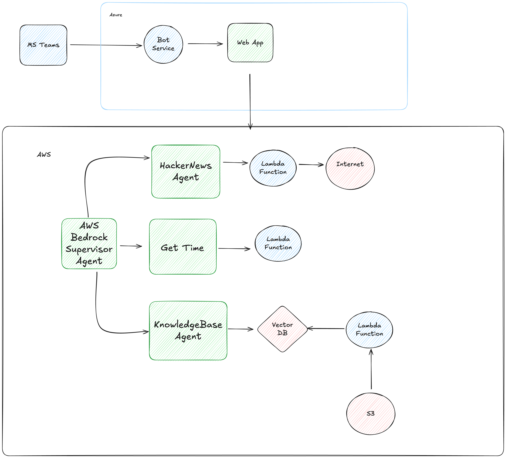
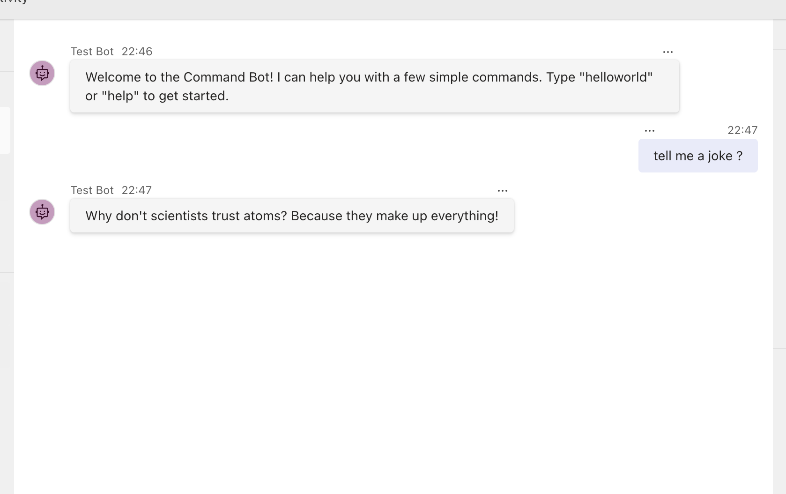

# BeeBot Agentic AI Chatbot Framework

A comprehensive AI chatbot framework that integrates Microsoft Teams with AWS Bedrock agents, powered by AWS Lambda functions for scalable, serverless AI operations.

## 🏆 AWS Lambda Hackathon Submission

This project is submitted for the [AWS Lambda Hackathon](https://awslambdahackathon.devpost.com/?) - "Build solutions that scale: power your ideas with AWS Lambda"

## 🚀 How This Application Uses AWS Lambda

### Core Lambda Architecture

Our application leverages AWS Lambda as the backbone for all AI agent operations, implementing a **serverless microservices architecture** that scales automatically based on demand. Here's how we use AWS Lambda:

#### 1. **Lambda Functions as Action Group Executors**
Each AI agent in our system uses dedicated Lambda functions to handle specific tasks:

- **HelloWorld Agent Lambda** (`lambda/helloWorld_agent/`): Handles basic greeting and demonstration operations
- **HackerNews Agent Lambda** (`lambda/hacker_news_agent/`): Fetches and processes Hacker News data via external APIs
- **Time Agent Lambda** (`lambda/time/`): Provides current time and date information
- **Knowledge Base Sync Lambda** (`lambda/sync_bedrock_knowledgebase/`): Manages document ingestion and knowledge base updates

#### 2. **Lambda Triggers and Integration**
Our Lambda functions are triggered through:

- **Direct Agent Invocation**: Bedrock agents directly invoke Lambda functions for action execution

#### 3. **Serverless Best Practices Implementation**
We follow AWS Lambda best practices:

```typescript
// Example from helloWorld_agent Lambda
export const handler = middy(adapter)
  .use(captureLambdaHandler(tracer))    // Distributed tracing
  .use(logMetrics(metrics));            // CloudWatch metrics
```

- **Observability**: Integrated with AWS Lambda Powertools for tracing, metrics, and logging
- **Error Handling**: Comprehensive error handling with proper HTTP status codes
- **Timeout Management**: 60-second timeouts for optimal performance
- **Cold Start Optimization**: Node.js 20.x runtime for better performance

#### 4. **Lambda Function Examples**

**HackerNews Agent Lambda** - Demonstrates external API integration:
```typescript
case '/getTopStories':
  if (httpMethod === 'GET') {
    const response = await axios.get<number[]>(TOP_STORIES_URL);
    const stories = response.data.slice(0, limit);
    body = { stories };
  }
  break;
```

**Time Agent Lambda** - Shows simple data processing:
```typescript
case '/getCurrentTime':
  if (httpMethod === 'GET') {
    body = {
      currentTime: new Date().toISOString()
    };
  }
  break;
```

#### 5. **Scalability and Performance**
- **Auto-scaling**: Lambda functions automatically scale from 0 to thousands of concurrent executions
- **Cost optimization**: Pay only for actual compute time used
- **High availability**: Multi-AZ deployment with automatic failover
- **Performance monitoring**: Real-time metrics and tracing

#### 6. **Integration with AWS Services**
Our Lambda functions integrate with:
- **AWS Bedrock**: For AI model inference and agent orchestration
- **Amazon S3**: For document storage and knowledge base management
- **CloudWatch**: For monitoring, logging, and alerting
- **IAM**: For secure access control and permissions

### Architecture Diagram


## Azure MS Teams Appz
Ensure you have node installed
```
nvm install v18.20.2
nvm use v18.20.2
```

Install dependencies
```
cd azure_msteams_app
npm install
```

## AWS Bedrock
```
nvm install v20.11.0
nvm use v20.11.0
```

Install dependencies
```
cd aws_bedrock
npm install
```

## Replace the AWS Bedrock AI Agent and AI Agent Alias Name
In the file `aws_bedrock/lib/aws_bedrock-stack.ts`, replace the AI Agent and AI Agent Alias Name with your own.
Search for `your-unique-agent-alias` and replace it with your own.

Ensure AWS CLI is configured with your credentials:
```
aws configure
```

Setup AWS Bedrock
```
cdk bootstrap
npx cdk deploy --all
```


## Run the MS Teams App locally
The output from AWS CDK will provide you with the Knowledge Base ID, Agent ID and Agent Alias ID.

Create the file `.localConfigs.testTool` from the `.localConfigs.testTool.example` file.
Update the `.localConfigs.testTool` file with the correct values.
```
AWS_AGENT_ALIAS_ID=
AWS_AGENT_ID=
AWS_KNOWLEDGE_BASE_ID=
```

## Install the Teams Toolkit Extension for Visual Studio Code


## Run the MS Teams App locally
```
cd azure_msteams_app
npm install
```

## Start Teams Toolkit

Click on the play icon


## Example of the MS Teams App Chat



## 🛠️ AWS Tools Used

- **AWS Lambda**: Core serverless compute service for all agent operations
- **AWS Bedrock**: AI model inference and agent orchestration
- **Amazon API Gateway**: RESTful API endpoints and Lambda triggers
- **AWS EventBridge**: Event-driven architecture for knowledge base sync
- **Amazon S3**: Document storage and knowledge base management
- **AWS CloudWatch**: Monitoring, logging, and observability
- **AWS IAM**: Security and access control
- **AWS CDK**: Infrastructure as Code deployment
- **AWS Lambda Powertools**: Observability and best practices

## 📊 Lambda Function Metrics

Our Lambda functions provide comprehensive metrics:
- **SuccessfulActionGroupQuery**: Tracks successful agent operations
- **ActionGroupQueryError**: Monitors error rates
- **Execution Duration**: Performance monitoring
- **Concurrent Executions**: Scalability tracking

## 🔒 Security Features

- **Least privilege access**: IAM roles with minimal required permissions
- **VPC isolation**: Lambda functions can run in private subnets
- **Encryption at rest**: All data encrypted using AWS KMS
- **API authentication**: Secure API Gateway endpoints
- **Environment variable protection**: Sensitive data stored securely

This application demonstrates how AWS Lambda can be used to build scalable, serverless AI applications that integrate seamlessly with enterprise communication platforms like Microsoft Teams.


